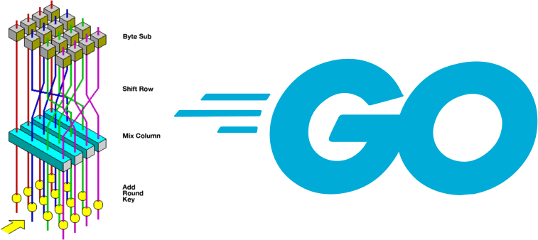

# GoCrypt - A Golang Encryption Helper Package
maintained by: [hkdb](mailto://hkdb@3df.io)

<br>



<br>

### SUMMARY:

Package 3dfosi/gocrypt provides simplified helper functions for using scrypt (128-bit salt, N=32768, r=8 and p=1) generated hash as a key to encrypt data with [AES-256](https://en.wikipedia.org/wiki/Advanced_Encryption_Standard)-[GCM](https://en.wikipedia.org/wiki/Galois/Counter_Mode).

Common use cases include but are not limited to encrypting data at rest for applications and symetric encryption automation prior to transfering files to destination.

### USAGE:

Import package:

```
import "github.com/3dfosi/gocrypt"
```

Example:

```go
package main

import (
	"encoding/hex"
	"log"

	"github.com/3dfosi/gocrypt"
)

var passphrase = "SOME-CRAZY-LONG-PASSPHRASE"

func main() {

	// Encrypt Data
	encrypted_data, salt, err := gocrypt.Encrypt([]byte("Hello World"), passphrase)
	if err != nil {
		log.Println(err)
		return
	}
	log.Println("Encrypted DATA:", hex.EncodeToString(encrypted_data))
	log.Println("SALT:", hex.EncodeToString(salt))

	// Decrypt Data
	plaintext, err := gocrypt.Decrypt(encrypted_data, salt, passphrase)
	if err != nil {
		log.Println(err)
		return
	}
	log.Println("Plain Text:", string(plaintext))

}
```

### DOCUMENTATION

Check out the [documentation(COMING SOON)](#) for further details on the functions available.


### CHANGE

- 09182022 - Initial commit

### SUPPORT US!

If this repo was useful to you, feel free to buy us some coffees! :)

[](https://www.buymeacoffee.com/3dfosi)

### DISCLAIMER

This repo is sponsored by 3DF OSI and is maintained by volunteers. 3DF Limited, 3DF OSI, and its volunteers in no way make any guarantees. Please use at your own risk!

To Learn more, please visit:

[https://osi.3df.io](https://osi.3df.io)

[https://3df.io](https://3df.io)
